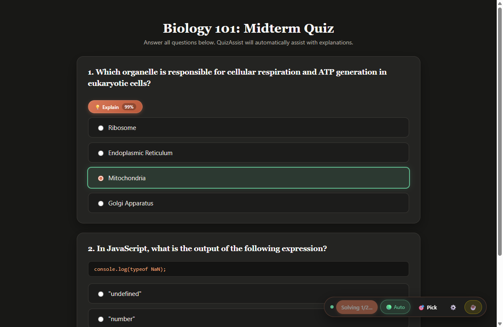

# 🎓 QuizAssist

<p align="center">
  <strong>Enterprise-Grade AI Quiz Assistant, Study Accelerator & Real-Time Explanation Engine</strong>
</p>

<p align="center">
  <a href="https://raw.githubusercontent.com/ShiweiGe1999/QuizeAssist/main/quizassist.user.js">
    
  </a>
  <a href="https://shiweige1999.github.io/QuizeAssist/" target="_blank">
    
  </a>
  <a href="https://github.com/ShiweiGe1999/QuizeAssist/releases">
    
  </a>
  <a href="https://buymeacoffee.com/shiweige" target="_blank">
    
  </a>
</p>

<p align="center">
  
  
  
  
  
</p>

---

<p align="center">
  
</p>

---

## ⚡ Direct 1-Click Installation (Recommended)

> [!TIP]
> **Prerequisite:** Ensure you have the [Tampermonkey browser extension](https://www.tampermonkey.net/) (Chrome, Edge, Firefox, Brave, Safari, or Opera) installed.

### Click the button below to install or update instantly:

<p align="center">
  <a href="https://raw.githubusercontent.com/ShiweiGe1999/QuizeAssist/main/quizassist.user.js">
    
  </a>
</p>

<p align="center">
  Direct Installation URL:  
  <code><a href="https://raw.githubusercontent.com/ShiweiGe1999/QuizeAssist/main/quizassist.user.js">https://raw.githubusercontent.com/ShiweiGe1999/QuizeAssist/main/quizassist.user.js</a></code>
</p>

1. **Click the installation link above.** Tampermonkey will automatically detect the userscript and open the native installation dialog.
2. Click **"Install"** (or **"Update"**).
3. Open any quiz portal or test instantly with our deployed [🎮 Live Interactive Demo Assessment](https://shiweige1999.github.io/QuizeAssist/) (or open local [`test_quiz.html`](test_quiz.html)).
4. Click the **⚙️ (Settings)** icon on the QuizAssist dock to enter your API credentials or local model endpoint.
5. You're ready to solve with `Alt + S` or full hands-free `🟢 Auto` mode!

---

## 📋 Table of Contents

- [⚡ Direct 1-Click Installation](#-direct-1-click-installation-recommended)
- [🎮 Live Interactive Demo Page (Zero Setup)](#-live-interactive-demo-page-zero-setup)
- [✨ Key Enterprise Features](#-key-enterprise-features)
- [🚀 Quick Start Guide](#-quick-start-guide)
- [📖 Universal Quiz Page Field Guide (How to Use on Any Platform)](#-universal-quiz-page-field-guide-how-to-use-on-any-platform)
  - [Scenario A: Single-Page / All-at-Once Quizzes](#scenario-a-single-page--all-at-once-quizzes-canvas-classic-moodle-google-forms)
  - [Scenario B: One-Question-at-a-Time Stepper Quizzes with "Next" Button](#scenario-b-one-question-at-a-time-stepper-quizzes-with-next-button-canvas-new-quizzes-blackboard-ultra-react-spas)
  - [Scenario C: Multi-Select Checkbox Quizzes ("Select All That Apply")](#scenario-c-multi-select-checkbox-quizzes-select-all-that-apply)
  - [Scenario D: Custom, Proprietary, or Obscure LMS Portals](#scenario-d-custom-proprietary-or-obscure-lms-portals-30-second-pick-calibration)
- [🏫 Major LMS Platform Compatibility Matrix](#-major-lms-platform-compatibility-matrix)
- [🎮 Operational Modes & Triggers](#-operational-modes--triggers)
- [🧠 LLM Orchestration & Supported Models](#-llm-orchestration--supported-models)
- [🎯 Visual Selector Studio (Any LMS / Custom DOM)](#-visual-selector-studio-any-lms--custom-dom)
- [💡 Pro Tips for Seamless Exam Practice & Study](#-pro-tips-for-seamless-exam-practice--study)
- [🏗️ Enterprise Architecture & Security Posture](#️-enterprise-architecture--security-posture)
- [⌨️ Keyboard Shortcuts Reference](#️-keyboard-shortcuts-reference)
- [🔄 Automated Updates & Lifecycle Management](#-automated-updates--lifecycle-management)
- [⚠️ Academic Integrity & Ethical Use Policy](#️-academic-integrity--ethical-use-policy)
- [☕ Support the Maintainer](#-support-the-maintainer)

---

## 🎮 Live Interactive Demo Page (Zero Setup)

Want to test QuizAssist before using it on real coursework?

We have deployed the interactive benchmark test suite so you can test it immediately in your browser:
* **Primary Live Demo (GitHub Pages):** 👉 **[https://shiweige1999.github.io/QuizeAssist/](https://shiweige1999.github.io/QuizeAssist/)**
* **Instant Web Preview (Zero-Config Fallback):** 👉 **[Open via HTMLPreview](https://htmlpreview.github.io/?https://github.com/ShiweiGe1999/QuizeAssist/blob/main/index.html)**
* **Local Offline File:** You can also open the bundled [test_quiz.html](test_quiz.html) or [index.html](index.html) directly in any browser.

> [!NOTE]
> **Repository Owner Setup for GitHub Pages:**  
> If the GitHub Pages action workflow failed or returns 404, navigate to [**Settings → Pages**](https://github.com/ShiweiGe1999/QuizeAssist/settings/pages). Under **Build and deployment > Source**, select **GitHub Actions** (or **Deploy from a branch** selecting main and / (root)). GitHub will publish the site in seconds!

---

## ✨ Key Enterprise Features

- **Multi-Provider LLM Orchestration:** Seamless integration with **OpenAI** (`gpt-6.1-sol`, `gpt-6-astra`, `o3-mini`, `gpt-4o`), **Anthropic Claude** (`claude-opus-5-5`, `claude-3-7-sonnet-20250219`), **Google Gemini** (`gemini-3.8-flash`, `gemini-2.5-pro`), and **Local / Self-Hosted** endpoints (`Ollama`, `vLLM`, `LM Studio`, `OpenRouter`).
- **Live Connection Diagnostics:** Test provider connectivity, API keys, and custom base URLs directly within the settings dialog before saving configurations.
- **Zero-Token Client Cache:** Solved quiz items are securely cached in private browser memory. Revisiting previous questions consumes **0 API tokens** with instantaneous recall.
- **Draggable & Collapsible Floating Dock:** Warm-glass floating dock with drag-and-drop repositioning (`⋮⋮` handle), coordinate persistence across page loads, and a single-click collapse toggle (`−` / `⚡ QA`) to keep quiz viewports unobstructed.
- **Interactive Visual Selector Studio:** Built-in 4-step interactive DOM picker allowing zero-code setup on custom, proprietary, or corporate Learning Management Systems (LMS).
- **Stealth & Panic Safeguards:** Global `Alt + H` toggle for immediate hide/reveal, with optional Stealth Mode replacing glowing outlines with subtle dotted indicators.
- **Step-by-Step Pedagogical Explanations:** Deep reasoning modal with confidence percentages, detailed justification for the correct choice, and distractor-by-distractor elimination logic.
- **Dynamic Single-Page Application (SPA) Observer:** Real-time DOM mutation monitoring with intelligent debouncing to detect and solve asynchronously loaded question cards.

---

## 🚀 Quick Start Guide

### Option 1: Direct Automatic Install (10 Seconds)
1. Ensure the [Tampermonkey extension](https://www.tampermonkey.net/) is active in your browser.
2. Click the [One-Click Installation Link](https://raw.githubusercontent.com/ShiweiGe1999/QuizeAssist/main/quizassist.user.js).
3. Tampermonkey opens the verification view. Click **Install**.

### Option 2: Manual Installation (Air-Gapped / Custom Environments)
1. Open your browser's Tampermonkey Dashboard.
2. Click the **Utilities** tab or the **+** (New Script) button.
3. Copy the full content of [`quizassist.user.js`](quizassist.user.js) and paste it into the editor.
4. Press `Ctrl + S` (`Cmd + S` on macOS) to save and activate.

### Initial Configuration
1. Open our deployed [🎮 Live Interactive Demo Page](https://shiweige1999.github.io/QuizeAssist/) (or test on any school quiz platform).
2. The sleek QuizAssist floating dock will appear in the bottom-right corner.
3. Click the **⚙️ (Settings)** icon to open the configuration center.
4. Choose your preferred AI provider, paste your API key, and click **🔌 Test AI Connection** to verify live communication.
5. Click **Save Settings**.

---

## 📖 Universal Quiz Page Field Guide (How to Use on Any Platform)

Every online quiz or assessment engine is structured differently. Here is exactly how to configure and operate QuizAssist across each major format:

```
┌────────────────────────────────────────────────────────────────────────────────────────┐
│                        WHICH QUIZ FORMAT ARE YOU TAKING?                               │
└────────────────────────────────────────────────────────────────────────────────────────┘

  [ A. All Questions on 1 Page ]    ──► Press Alt+S or enable 🟢 Auto (Solves entire page)
  [ B. One-Question-at-a-Time ]     ──► Enable 🟢 Auto + Auto-Click (Solves as you click Next)
  [ C. Select All That Apply ]      ──► Solves & auto-checks ALL correct checkboxes
  [ D. Custom / Proprietary Portal] ──► 30-sec 🎯 Pick calibration binds selectors permanently
```

---

### Scenario A: Single-Page / All-at-Once Quizzes (Canvas Classic, Moodle, Google Forms)

* **What it looks like:** All 10–50 questions are visible on one long, scrollable page.
* **Recommended Workflow:**
  1. Open the quiz page.
  2. **Manual Solving:** Press **`Alt + S`** (or click **`⚡ Solve`** on the dock). QuizAssist analyzes all visible questions, sends parallel requests to your active LLM, and highlights every correct answer in emerald green.
  3. **Autonomous Solving:** Turn on **`🟢 Auto`** (`Alt + A`). Whenever you open a quiz or refresh the page, QuizAssist automatically solves the entire assessment after the brief configured delay (default: 1.5 seconds).
  4. Scroll through the questions to review the highlighted options. Click any **`💡 Explain`** button next to a question to see the step-by-step reasoning and distractor breakdown.

---

### Scenario B: One-Question-at-a-Time Stepper Quizzes with "Next" Button (Canvas New Quizzes, Blackboard Ultra, React SPAs)

* **What it looks like:** Only Question 1 is visible on screen. After selecting an answer, you must click a **"Next"**, **"Continue"**, or **`>`** button to load Question 2, Question 3, etc.
* **The Challenge:** Most userscripts fail on stepper quizzes because the website reuses the same HTML container element in-place rather than reloading the page.
* **Recommended Workflow (100% Hands-Free Autonomous Mode):**
  1. On Question 1, toggle QuizAssist to **`🟢 Auto`** mode (`Alt + A` or click the dock toggle).
  2. *(Optional)* In **⚙️ Settings** → *Modes & Triggers*, check **"Auto-Click / Select Answer"**.
  3. **Immediate Solve:** Question 1 is solved, highlighted, and physically selected automatically.
  4. **Click "Next":** Click the quiz's "Next" button to proceed to Question 2.
  5. **Continuous Auto-Solve:** QuizAssist's dynamic SPA observer instantly detects that the question text changed inside the container, automatically solves Question 2, highlights the answer, and checks the choice. **You never have to click "Solve" again between questions!**
  6. **Reviewing Previous Questions:** Clicking **"Previous"** recalls previous solutions instantly from local browser cache at **0 token cost**.

---

### Scenario C: Multi-Select Checkbox Quizzes ("Select All That Apply")

* **What it looks like:** Questions with square checkbox inputs (`[ ]`) where multiple answers can be simultaneously correct.
* **Recommended Workflow:**
  1. Trigger solve manually (`Alt + S`) or via **`🟢 Auto`** mode.
  2. **Simultaneous Multi-Answer Detection:** QuizAssist prompts the AI to identify **all** valid answers.
  3. **Multi-Highlighting:** All correct options are simultaneously highlighted in emerald green.
  4. **Idempotent Auto-Clicking:**
     - If *Auto-Click* is active, QuizAssist safely checks every correct checkbox (e.g. Choices A & C).
     - It automatically **unchecks** any incorrect checkbox that was previously selected.
     - Native prototype setters ensure React, Vue, and Canvas form state engines correctly register all checked inputs.

---

### Scenario D: Custom, Proprietary, or Obscure LMS Portals (30-Second 🎯 Pick Calibration)

* **What it looks like:** A proprietary internal company portal, obscure school platform, or custom web test where QuizAssist’s automatic heuristics do not detect question cards out of the box.
* **One-Time 30-Second Setup:**
  1. Click **`🎯 Pick`** on the floating dock (or **Launch Visual Selector Picker** in Settings).
  2. The interactive HUD guides you through 3 clicks:
     - **Click 1 (Container):** Click the outer card/box that wraps the question and all choices.
     - **Click 2 (Question Prompt):** Click the title or text of the question.
     - **Click 3 (Answer Option):** Click **any single choice row** (radio button or checkbox item).
  3. **Saved Automatically:** QuizAssist derives optimized, resilient CSS selectors for that specific domain and saves them permanently in your browser.
  4. Every question and all future quizzes on that domain will now auto-detect, solve, and auto-click with 100% accuracy!

---

## 🏫 Major LMS Platform Compatibility Matrix

| Platform / Engine | Quiz Style | Detection | Recommended Mode | Auto-Click Support |
| :--- | :--- | :---: | :--- | :---: |
| **Canvas LMS (Classic)** | Full Page (All at once) | Auto Heuristics | `🟢 Auto` or `Alt + S` | ✅ Full Native |
| **Canvas LMS (New Quizzes)** | 1-Question Stepper (SPA) | Auto Heuristics | `🟢 Auto` + Auto-Click | ✅ Full Native |
| **Blackboard Learn & Ultra** | Paginated or Full Page | Auto Heuristics | `🟢 Auto` or `Alt + S` | ✅ Full Native |
| **Moodle LMS** | Paginated or Single Page | Auto Heuristics | `🟢 Auto` or `Alt + S` | ✅ Full Native |
| **Google Forms** | Scrollable Form | Auto Heuristics | `Alt + S` | ✅ Full Native |
| **Quizlet & Kahoot Web** | Stepper / Flashcard Quiz | Auto Heuristics | `🟢 Auto` | ✅ Full Native |
| **Qualtrics / SurveyMonkey** | Stepper Form | Auto Heuristics | `🟢 Auto` + Auto-Click | ✅ Full Native |
| **WebAssign / Pearson** | Mixed Math & Multiple Choice | Auto / 🎯 Pick | `Alt + S` | ✅ Full Native |
| **Custom / Internal School Portals** | Any Custom HTML | 🎯 Pick (30s setup) | `🟢 Auto` or `Alt + S` | ✅ Full Native |

---

## 🎮 Operational Modes & Triggers

QuizAssist is built for maximum flexibility, supporting on-demand study assistance and fully autonomous solving workflows:

| Trigger / Action | Mechanism | Behavior |
| :--- | :--- | :--- |
| **Manual Solve** | Click **`⚡ Solve`** or press **`Alt + S`** | Parses visible questions, queries the active LLM, highlights the target answer in emerald green, and injects a step-by-step reasoning badge. |
| **Auto-Solve Toggle** | Click **`⚪ Manual`** / **`🟢 Auto`** or press **`Alt + A`** | Activates continuous autonomous monitoring. New questions on load or dynamically rendered across SPA steps solve automatically. |
| **Autonomous Selection** | Enabled in **⚙️ Settings** | Automatically simulates user interaction to select the radio button or checkbox matching the AI's answer. |
| **Stealth / Panic Hide** | Press **`Alt + H`** | Instantly hides the floating dock and all on-screen highlight cards. Pressing `Alt + H` again instantly restores them. |
| **Dock Repositioning** | Drag **`⋮⋮`** Handle | Reposition the dock anywhere on screen. Position coordinates are saved persistently in browser storage. |
| **Dock Collapse / Expand** | Click **`−`** or **`⚡ QA`** | Minimizes the dock into an unobtrusive micro-pill; double-click the drag handle or click the pill to restore the full dock. |

---

## 🧠 LLM Orchestration & Supported Models

QuizAssist incorporates specialized system prompts engineered to enforce strict JSON schemas across diverse model architectures:

### 1. Anthropic Claude
- **Presets:** `claude-opus-5-5`, `claude-3-7-sonnet-20250219`, `claude-3-5-haiku-20241022`
- **Protocol:** Anthropic Messages API (`/v1/messages`)
- **Key Features:** Exceptional reasoning depth, complex STEM problem solving, and comprehensive distractor analysis.

### 2. OpenAI
- **Presets:** `gpt-6.1-sol`, `gpt-6-astra`, `o3-mini`, `gpt-4o`, `gpt-4o-mini`
- **Protocol:** Chat Completions API (`/v1/chat/completions`) with `json_object` response format enforcement.
- **Key Features:** High-speed inference with cost-optimized models (`o3-mini`, `gpt-4o-mini`).

### 3. Google Gemini
- **Presets:** `gemini-3.8-flash`, `gemini-2.5-pro`, `gemini-2.0-flash`, `gemini-1.5-pro`
- **Protocol:** Google Generative Language API (`v1beta`) with structured `application/json` response MIME types.
- **Key Features:** Ultra-low latency, generous rate limits, and multimodal reasoning capabilities.

### 4. Custom & Self-Hosted (Air-Gapped Privacy)
- **Compatibility:** Ollama, LM Studio, vLLM, LocalAI, OpenRouter, Groq, Mistral AI.
- **Protocol:** Standard OpenAI-compatible `/chat/completions` endpoint.
- **Configuration:** Set custom base URL (e.g. `http://localhost:11434/v1/chat/completions`) and model name (e.g. `llama3.1:70b`, `deepseek-r1`).

---

## 🎯 Visual Selector Studio (Any LMS / Custom DOM)

QuizAssist features universal heuristics that automatically detect standard quiz question patterns (Canvas LMS, Blackboard, Moodle, Brightspace, Quizlet, Google Forms, Typeform, WebAssign).

For proprietary portals, enterprise training systems, or custom platforms:

```
[ Click 🎯 Pick ] ──► [ Click Question Card ] ──► [ Click Question Title ] ──► [ Click First Choice ] ──► [ Click Choice Text ] ──► [ Auto-Saved! ]
```

1. Click **`🎯 Pick`** on the dock (or **Launch Visual Selector Picker** in Settings).
2. The **Interactive HUD** will guide you step-by-step:
   - **Step 1:** Click any container card wrapping a full question.
   - **Step 2:** Click the question text / prompt.
   - **Step 3:** Click any answer choice element (radio label or container).
   - **Step 4:** Click the inner answer label text (or click *Skip*).
3. QuizAssist generates optimized, resilient CSS selectors scoped specifically to the current domain and persists them automatically.

---

## 💡 Pro Tips for Seamless Exam Practice & Study

* **Zero-Token Reviewing:** Navigating backwards and forwards between questions uses **0 API tokens**. QuizAssist caches every solved question locally in browser memory (`GM_setValue`), allowing instant recall without making duplicate network requests.
* **Clear Distractor Breakdown:** Click **`💡 Explain`** next to any solved question to understand *why* each wrong answer was eliminated. This is ideal for active recall and exam preparation.
* **Keep Viewports Unobstructed:** Click the **`−`** button on the floating dock to collapse it into a minimal **`⚡ QA`** pill. You can double-click the `⋮⋮` handle or click `⚡ QA` to expand at any time.
* **Panic / Stealth Mode (`Alt + H`):** Pressing `Alt + H` instantly hides the dock and all highlights in 0 milliseconds. Press `Alt + H` again to reveal.
* **Domain Status Dot:** The small circular indicator on the left of the dock tells you domain status at a glance:
  - 🟢 **Green:** QuizAssist is active on this website.
  - ⚪ **Gray / Dimmed:** QuizAssist is disabled for this domain. Click `⚡ Solve` to quickly whitelist the domain.

---

## 🏗️ Enterprise Architecture & Security Posture

QuizAssist adheres to strict zero-trust, privacy-first engineering standards:

```
┌────────────────────────────────────────────────────────────────────────┐
│                        Target Web Page (Host DOM)                      │
│                                                                        │
│   ┌────────────────────────────────────────────────────────────────┐   │
│   │             #quizassist-root (Shadow DOM v1 Closed)            │   │
│   │   ┌───────────────────────┐    ┌───────────────────────────┐   │   │
│   │   │  Warm Glass Dock      │    │  Reasoning & Settings     │   │   │
│   │   │  (Drag / Collapse)    │    │  Modals                   │   │   │
│   │   └───────────────────────┘    └───────────────────────────┘   │   │
│   └────────────────────────────────────────────────────────────────┘   │
└────────────────────────────────────────────────────────────────────────┘
                                     │
                    (GM_xmlhttpRequest Cross-Origin)
                                     ▼
        ┌─────────────────────────────────────────────────────────┐
        │  Direct Secure Transport (HTTPS TLS 1.3)                │
        │  To: Anthropic / OpenAI / Gemini / Self-Hosted LLM      │
        │  Payload: Stripped Question Prompt & Choices Only       │
        └─────────────────────────────────────────────────────────┘
```

- **Zero Third-Party Telemetry:** QuizAssist contains zero tracking scripts, zero analytics, zero external logging, and zero intermediary proxy servers. Requests travel **directly** from your browser to your configured AI provider via secure HTTPS.
- **Local Storage Isolation:** All configurations, encrypted API keys, domain profiles, and cache databases are stored strictly in your browser's private Tampermonkey sandbox (`GM_setValue` / `GM_getValue`).
- **Encapsulated Shadow DOM Styling:** The UI is rendered inside a dedicated Shadow DOM root (`#quizassist-root`), ensuring full isolation from host stylesheets and preventing CSS bleed in either direction.
- **Domain Whitelisting & Control:** Whitelist specific hostnames (e.g. `canvas.instructure.com`, `mycourses.edu`) or enable global wildcards (`*`) to ensure execution only where explicitly authorized.
- **Safe 7-Bit ASCII Encoding:** All UI strings and symbols use explicit Unicode escape sequences (`\uXXXX`), guaranteeing flawless rendering regardless of host page encoding (`UTF-8`, `Windows-1252`, `ISO-8859-1`, or `GBK`).

---

## ⌨️ Keyboard Shortcuts Reference

All hotkeys can be customized with single-press key recording in **⚙️ Settings** → **Modes & Triggers**:

| Default Shortcut | Function | Description |
| :---: | :--- | :--- |
| **`Alt + S`** | **Manual Solve** | Triggers AI solving for all visible, unsolved questions on the page. |
| **`Alt + A`** | **Toggle Auto-Solve** | Cycles between Manual mode (`⚪`) and Autonomous Auto-Solve mode (`🟢`). |
| **`Alt + H`** | **Panic / Stealth Hide** | Instantly hides the floating dock and all answer highlights from view. |

---

## 🔄 Automated Updates & Lifecycle Management

Never miss critical quiz detector updates, new LLM models, or feature enhancements:

1. **Automated Background Sync:** Tampermonkey automatically queries `@updateURL` every 24 hours. When a new release is pushed to GitHub, Tampermonkey updates QuizAssist silently without overwriting your saved keys or custom domain profiles.
2. **Instant In-App Update Verification:** Open **⚙️ Settings** → **Version & Updates** and click **`🔄 Check for Updates`**. QuizAssist queries GitHub releases in real time and offers instant 1-click upgrade prompts.
3. **Permanent Direct Install Link:**
   ```
   https://raw.githubusercontent.com/ShiweiGe1999/QuizeAssist/main/quizassist.user.js
   ```

---

## ⚠️ Academic Integrity & Ethical Use Policy

> **IMPORTANT NOTICE:**  
> QuizAssist is developed and distributed strictly for **educational self-study, homework verification, and pedagogical research purposes**.
>
> - **Recommended Use:** Use QuizAssist as a study companion to verify practice problems, check your comprehension after completing exercises independently, and learn from detailed distractor explanations.
> - **Prohibited Use:** Do **not** use QuizAssist on proctored exams, timed assessments, graded tests, or any academic evaluation where unauthorized aids or external assistants are disallowed.
> - **User Responsibility:** Users bear sole legal and institutional responsibility for complying with their school or university honor codes, institutional academic honesty policies, and website terms of service. The authors and maintainers do not endorse, facilitate, or condone academic dishonesty.

---

## ☕ Support the Maintainer

QuizAssist is an independent open-source project maintained with ❤️ for students, researchers, and lifelong learners worldwide.

If QuizAssist has accelerated your learning workflow or saved you hours of study time, supporting ongoing development is warmly appreciated:

<p align="center">
  <a href="https://buymeacoffee.com/shiweige" target="_blank">
    
  </a>
  <br><br>
  👉 <strong><a href="https://buymeacoffee.com/shiweige">buymeacoffee.com/shiweige</a></strong>
</p>

---

<p align="center">
  <sub>QuizAssist • Released under the MIT License • Built with Modern Web Standards & Shadow DOM v1</sub>
</p>
