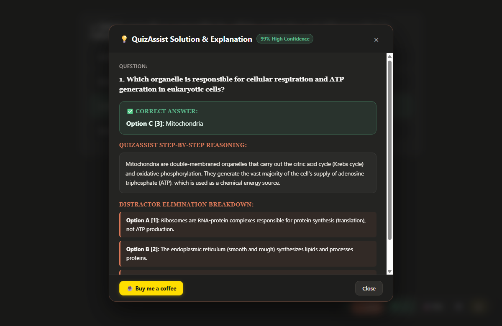
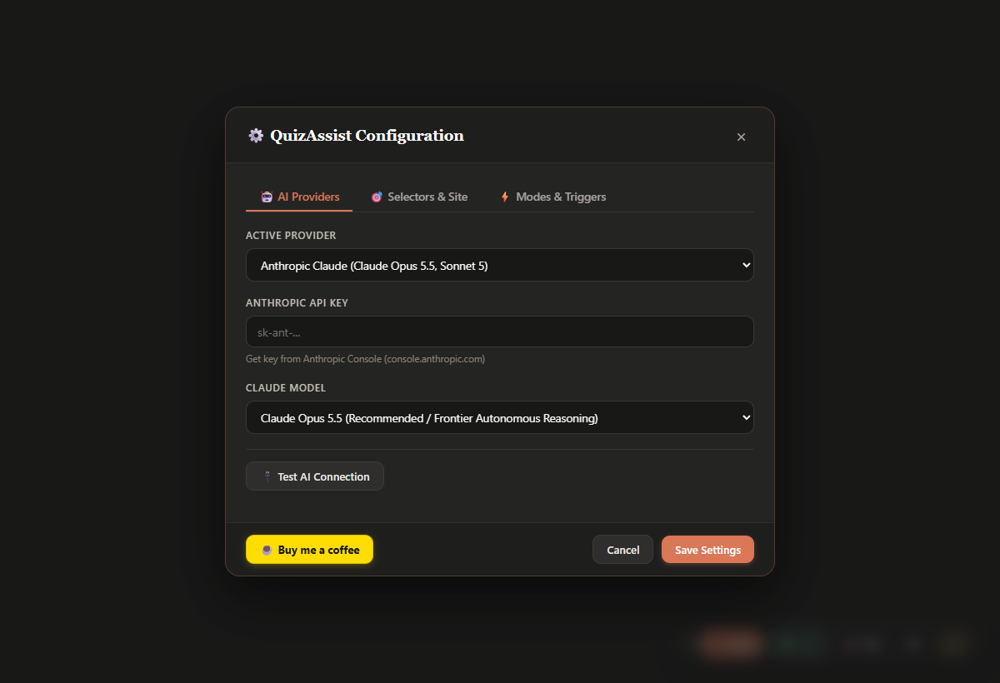

# 🎓 QuizAssist

A lightweight browser userscript for Tampermonkey that solves online quiz questions, highlights correct answers, auto-selects choices, and gives you clear step-by-step explanations when you want to learn.

  

  

---

## ⚠️ Educational Purpose & Anti-Plagiarism Disclaimer

> **PLEASE READ CAREFULLY:**  
> QuizAssist is developed and provided strictly for **educational, study, and research purposes only**.
>
> * **Self-Study & Homework Verification:** Use QuizAssist as a study companion to test your understanding, check practice problems after attempting them yourself, and learn from detailed distractor explanations.
> * **Zero Tolerance for Academic Dishonesty:** Do **not** use QuizAssist for cheating, plagiarism, proctored exams, graded assessments, or any situation where unauthorized assistance is prohibited.
> * **Honor Code & Academic Integrity:** You are solely responsible for following your institution's honor codes, academic honesty guidelines, and platform terms of service. The developers do not endorse or condone any academic misconduct.

---

## 🚀 Quick Start (Under 2 Minutes)

### 1. Install Tampermonkey
Make sure you have the free [Tampermonkey extension](https://www.tampermonkey.net/) installed in your browser (Chrome, Edge, Brave, or Firefox).

### 2. Add QuizAssist Script
1. Click the Tampermonkey icon in your browser toolbar → **Create a new script**.
2. Replace whatever is inside the editor with the code from [`quizassist.user.js`](quizassist.user.js).
3. Press `Ctrl + S` to save.

*(Or simply click the direct installation link in the [Automatic Updates](#-automatic-updates) section below).*

### 3. Add Your API Key & Start Solving
1. Open any quiz page (or our benchmark page [`test_quiz.html`](test_quiz.html)).
2. Look at the bottom-right corner for the floating QuizAssist dock.
3. Click the **⚙️ (Settings)** icon.
4. Choose your provider, paste your API key, and click **Save Settings**.

---

## ⚡ How to Use It

QuizAssist works seamlessly whether you want on-demand help or hands-free auto-solving:

| Mode | How to Trigger | What Happens |
| :--- | :--- | :--- |
| **Manual Click** | Click **⚡ Solve** on the dock | Scans the visible questions, identifies the right answer, and highlights it cleanly in green. |
| **Keyboard Shortcut** | Press **`Alt + S`** | Solves questions anywhere on the page without reaching for your mouse. |
| **Auto-Solve** | Click **`⚪ Manual`** on the dock (or press **`Alt + A`**) | Switches to **`🟢 Auto`**. Any quiz you open solves automatically. It also monitors single-page apps (SPA) and automatically answers new questions as they load. |
| **Auto-Click Choice** | Enable in Settings | Automatically checks the radio button or checkbox so you don't have to click it yourself. |
| **Instant Hide** | Press **`Alt + H`** | Instantly hides the dock and all answer highlights from the screen. Press again to restore. |

---

## 💡 Clear Explanations & Distractor Breakdown

Whenever an answer is highlighted, a **💡 Explain** button appears next to the question. Clicking it opens a clean breakdown showing why that choice is correct and exactly why each other option was eliminated:

  

---

## ⚙️ Settings & Customization

Click the **⚙️** icon on the dock at any time to open the configuration panel:

  

* **AI Provider:** Connect your preferred API or point it to a local endpoint (such as Ollama or LM Studio).
* **Auto-Solve Delay:** Choose how many seconds to wait after a page loads before auto-solving begins.
* **Custom Shortcuts:** Customize `Alt + S`, `Alt + A`, or `Alt + H` to your preferred key combinations.
* **Local Response Cache:** Solved questions are saved locally in your browser. Re-visiting a question consumes **0 API tokens**.

---

## ⌨️ Shortcuts Reference

* **`Alt + S`** — Solve questions on screen
* **`Alt + A`** — Toggle Auto-Solve mode on / off
* **`Alt + H`** — Panic hide / reveal toggle

---

## 🔄 Automatic Updates

QuizAssist includes built-in update tracking so you always have the latest quiz detectors and bug fixes:

1. **Tampermonkey Automatic Updates:** Tampermonkey checks `@updateURL` automatically in the background (typically every 24 hours). When a new version is released on GitHub, Tampermonkey updates QuizAssist silently without affecting your API keys or saved preferences.
2. **Instant In-App Check:** Open the **⚙️ Settings** modal from the dock and click **🔄 Check for Updates**, or use the Tampermonkey context menu item **QuizAssist: Check for Updates**.
3. **One-Click Install Link:** New users or fresh browsers can install directly by clicking:  
   [`https://raw.githubusercontent.com/ShiweiGe1999/QuizeAssist/main/quizassist.user.js`](https://raw.githubusercontent.com/ShiweiGe1999/QuizeAssist/main/quizassist.user.js)

---

## 🔒 Privacy & Local Storage

* Everything is saved **100% locally in your browser** via Tampermonkey's private storage.
* Your API keys and cached questions never leave your computer and are never shared or uploaded to third-party telemetry servers.

---

## ☕ Support QuizAssist

If QuizAssist helped you study more efficiently or saved you time, buying me a coffee is greatly appreciated!

  
    
  👉 <a href="https://buymeacoffee.com/shiweige"><strong>buymeacoffee.com/shiweige</strong></a>

